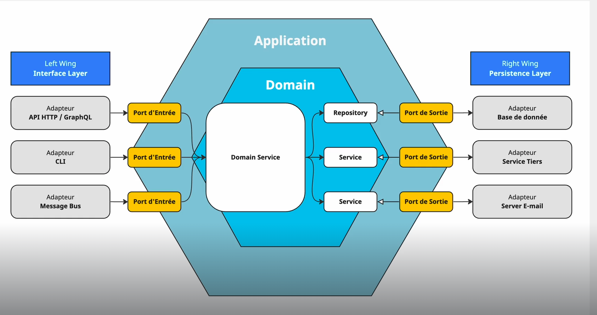

# Choix du style d'architecture de l'application 

## Contexte du projet (Rappel)

Plateforme SaaS éducative permettant aux écoles de créer des parcours d'apprentissage personnalisés avec agents IA supervisés par des professeurs.

Contraintes principales lié au projet :
- Isolation par école : application multi-tenant.
- Conformité juridique (RGPD) : nécessite bonne isolation/protection des données, accés et modification aisé.
- Temps réel & IA : montée en charge et enjeux de scalabilité conséquents.
- Domaines métiers bien identifiés et isolable
- Equipe de développement réduite (projet RNCP à faire seul pour le MVC puis peu de moyen pour mobiliser une grande équipe si développement commercial)
- Compétences en développement réduite : niveau Junior, surtout habitué au MVC et à la clean architecture, pas aux autres architectures.
- Temps limité pour développer le MVC (Délai de la formation sur quelques mois)
- Enjeux fort d'évolutivité : partir d'un MVC et migrer sans mal sur une application plus solide, partir d'un ensemble restreint de fonctionnalité mais ouvert à forte évolution.
- Enjeux fort de scalabilité/élasticité : usage d'AWS afin de se permettre une élasticité si montée subite en charge (pic) donc l'architecture doit permettre d'en profiter.
- Enjeux de sécurité et conformité lié : protection des données élèves, risques juridiques, nécessite une architecture qui isole en cas d'attaque sur un plan.

## Styles envisagé

### MVC (Model-View-Controller)
Description : Séparation UI / logique / données au niveau application

Forces :

- Pattern éprouvé pour interfaces web
- Séparation claire présentation/métier
- Next.js et frameworks modernes l'implémentent nativement

Faiblesses :

- Insuffisant pour structurer 6 domaines métiers complexes
- Ne traite pas la distribution des responsabilités backend
- Pas adapté aux agents IA et RAG qui nécessitent services spécialisés

### Architecture en couches (Layered)
Description : Organisation horizontale (Présentation / Métier / Données / Infrastructure)

Forces :

- Structure claire et pédagogique
- Facilite la maintenabilité
- Testabilité par couche
- Alignement naturel avec équipe junior/intermédiaire

Faiblesses :

- Couplage entre couches si mal implémenté
- Moins flexible pour évolution vers distribution
- Tous les domaines métiers traversent les mêmes couches

### SOA (Service-Oriented Architecture)
Description : Services métiers autonomes communiquant par API

Forces :

- Excellente séparation domaines (Utilisateurs, Parcours, IA, etc.)
- Scalabilité ciblée par service
- Évolution indépendante des services
- Alignement fort avec vue logique (6 blocs métiers)

Faiblesses :

- Complexité opérationnelle (déploiement, monitoring multiple)
- Overhead communication inter-services
- Nécessite expertise distribuée dès le début

### Microservices

Faiblesses: 

- Overhead trop élevé pour MVP
- Équipe pas dimensionnée
- Complexité réseau et orchestration excessive
- Pas justifié par la volumétrie initiale

**Conclusion**

MVC : adapté au délai formation mais insuffisant pour plateforme complète
Couches : bon compromis pédagogique mais évolution difficile
SOA : idéal long terme mais trop complexe pour équipe seule et délai court

## Analyse comparative

Analyse comparative

### MVC vs Architecture en couches

MVC offre une séparation claire au niveau présentation mais reste insuffisant pour organiser le backend complexe de la plateforme. L'architecture en couches étend ce principe en ajoutant des couches métier et infrastructure explicites, permettant une meilleure structuration des 6 domaines fonctionnels identifiés.

Là où MVC se concentre uniquement sur l'interaction utilisateur, les couches apportent une organisation complète de l'application incluant la persistance, la logique métier et les services externes. Pour un projet comme la plateforme d'apprentissage avec des agents IA, du RAG et du multi-tenant, MVC seul ne fournit pas assez de structure pour gérer cette complexité.Cependant, MVC reste plus simple à implémenter initialement pour une équipe junior habituée à ce pattern, tandis que l'architecture en couches demande une discipline plus stricte sur les dépendances entre niveaux. 

Le risque avec les couches est de créer des couplages cachés si la séparation n'est pas rigoureusement maintenue.

#### Architecture en couches vs SOA

L'architecture en couches organise l'application horizontalement (présentation, métier, données) tandis que SOA la découpe verticalement par domaines métiers autonomes. Pour les 6 blocs identifiés (Utilisateurs, Parcours, IA, Communication, Facturation, Reporting), SOA offre une isolation naturelle que les couches ne garantissent pas.Les couches imposent que tous les domaines traversent les mêmes niveaux techniques, créant un couplage structurel. Par exemple, une évolution du module IA nécessite potentiellement de toucher aux couches présentation, métier et données, même si conceptuellement seul le domaine IA est concerné. SOA évite ce problème en encapsulant chaque domaine complètement.

Niveau scalabilité, les couches obligent à scaler l'application entière tandis que SOA permet un scaling ciblé. Le module IA gourmand en GPU pourrait avoir 10 instances quand le module facturation n'en a que 2. Cette élasticité différenciée est impossible avec les couches pures.Cependant, SOA introduit une complexité opérationnelle majeure : monitoring distribué, gestion des défaillances inter-services, transactions distribuées, latence réseau. Pour une équipe junior devant livrer un MVP rapidement, cette complexité est un frein important. Les couches offrent une simplicité de déploiement (monolithe unique) et de debugging (stack trace complète) précieuse en phase initiale.Le compromis clé : les couches facilitent le démarrage mais compliquent l'évolution, SOA complexifie le démarrage mais facilite l'évolution.

#### MVC vs SOAMVC et SOA répondent à des problématiques différentes. 

MVC structure l'interaction utilisateur au niveau interface, SOA structure les responsabilités métier au niveau système distribué. Comparer les deux directement est peu pertinent car ils opèrent à des niveaux d'abstraction différents.On pourrait avoir du MVC dans chaque service d'une architecture SOA pour organiser la couche présentation de ce service. Inversement, on ne peut pas remplacer SOA par MVC car MVC ne traite pas la distribution des domaines métiers, la scalabilité différenciée ou l'isolation multi-tenant robuste.Pour la plateforme d'apprentissage, MVC seul est clairement insuffisant. SOA seul est trop complexe pour l'équipe et le délai. La vraie question devient : comment structurer le backend au-delà de MVC ? D'où l'intérêt de l'architecture en couches comme alternative.

**Synthèse:**

Pour les contraintes du projet (équipe junior, délai court, évolutivité forte requise, scalabilité AWS), aucun style pur ne répond parfaitement :MVC est trop limité pour la complexité backend mais offre la meilleure accessibilité pour l'équipe.Architecture en couches apporte la structure manquante à MVC avec une complexité acceptable, mais limite l'évolution future vers la distribution nécessaire pour la scalabilité AWS optimale.SOA répond idéalement aux besoins de scalabilité, évolutivité et isolation multi-tenant, mais impose une complexité de démarrage incompatible avec les contraintes d'équipe et de délai.

## Style retenu

Pour notre MVC, nous retenons une architecture en couche au sein d'un monolithe modulaire avec un usage important de l'inversion de dépendance. Le SOA pourrait éventuellement être retenu pour la production final mais nous ne nous positionnons qu'une fois l'expérience via le MVC est acquise car la question reste ouverte.

Le I de SOLID devient pour nous crucial d'autant que l'on ne va pas organiser tout de suite une séparation totale. 
Cela afin de ne pas se surcharger en coût d'infrastructure (comme ce serait le cas avec les micro-services).

Nous seront alors attentif à respecter une cohésion forte entre les composants au sein d'une couche et d'organiser entre-eux un couplage le plus faible possible.

En utilisant des interfaces, nous inversons les dépendances afin d'isoler au maximum le domaine qui ne dépendra pas des autres couches mais les autres couches dépendent de lui. Nous évitons les dépendances circulaires aussi. Le domaine contient les entités métiers de base, c'est ce qu'il y a de plus stable et de plus durable. 

Ainsi ne le faire dépendre de quasiment rien permet de profiter de sa stabilité long terme et faire évoluer notre application sans mal en cas d'ajout. 

Cette architecture est idéal pour un démarrage car sans la lourdeur des micro-service ou du SOA, elle permet aussi une testabilité accru en isolant les parties pertinente du code. Articulé autour de règles métiers, elle permet de savoir exactement et rapidement d'où sont venu les problèmes en cas de bug. Il est également possible en respectant le L de SOLID de permettre à nos class d'être ouverte à l'extension mais pas aisément modifiable via l'organisation par couche qui facilite le respect de cette logique et nous protégeons le système sans se fermer à l'évolution.

Voici une idée de l'organisation de nos couches :

```js

/presentation (API REST + UI)
  /controllers
  /middleware

/application (Modules et use-cases en sous-partie des modules)
  /user-module
  /learning-module
  /ai-module
  /communication-module
  /billing-module
  /reporting-module

/domain (Logique métier pure: entités)
  /user
  /learning
  /ai
  /communication
  /billing
  /reporting

/infrastructure (Technique)
  /database
  /cache
  /storage
  /messaging

/core (Abstractions partagées)
  /interfaces
  /exceptions
  /types-communs

```

Une image d'architecture hexagonal qui inspire fortement notre choix:



## Justification métier

### Délai formation contraint
- Formation RNCP impose livraison MVP fonctionnel en quelques mois. 
- Architecture en couches permet progression rapide avec pattern connu (MVC étendu). 
- SOA poussé : apprentissage trop long pour action solo dans ce délai.

### Équipe réduite ou même action solo 
- Développement seul puis petite équipe junior. 
- Couches + modularisation offre structure compréhensible sans complexité opérationnelle. Monitoring simple, déploiement unique, debugging facilité.

### Conformité RGPD pragmatique
- Modularisation forte permet isolation logique des données élèves dans learning-module et user-module. Contrôle d'accès par module. 
- Traçabilité par couche. 
- Suffisant pour conformité initiale sans la lourdeur SOA.

### Évolutivité progressive garantie
- Structure modulaire préfigure extraction future en services. 
- Chaque module a interfaces claires, dépendances explicites, responsabilités isolées. Migration vers SOA facilitée sans réécriture complète (extraction module = nouveau service).

### Coût maîtrisé
- Monolithe = infrastructure simple, coûts prévisibles. 
- Phase MVP sur VPS réduit. 
- Production AWS avec scaling horizontal du monolithe entier puis extraction modules critiques seulement si volumétrie justifie.

### Multi-tenant simplifié
Isolation par schéma PostgreSQL ce qui est suffisant pour dune dizaines d'écoles au lancement. Il y aura une migration vers des bases dédiées possible si croissance forte, facilitée par modules indépendants.

## Justification technique

Courbe apprentissage acceptable
Architecture en couches connue de l'équipe (MVC étendu). Ajout modularisation par domaine apporte structure sans révolution conceptuelle. Progression naturelle des compétences.
Déploiement immédiat fonctionnel
Conteneur Docker unique, CI/CD simple, logs centralisés. Pas de coordination inter-services, pas de tracing distribué, pas de mesh réseau. Opérationnel en jours, pas semaines.
Testabilité par couche et module
Tests unitaires domain isolés sans dépendances. Tests application avec mocks infrastructure. Tests intégration par module. Tests end-to-end sur monolithe complet. Simplicité supérieure à SOA.
Performance monolithe suffisante
Appels internes en mémoire, pas latence réseau. Transactions ACID natives PostgreSQL. Cache Redis local. Performances largement suffisantes pour volumétrie initiale (centaines utilisateurs simultanés).
Scalabilité horizontale immédiate
AWS Auto Scaling Group scale le monolithe complet. Load Balancer distribue charge. Sessions Redis partagé. Acceptable jusqu'à milliers d'utilisateurs actifs. Extraction WebSocket si nécessaire (stateful).
Stack technique homogène
Golang monolithe + PostgreSQL + Redis + Next.js frontend. Pas coordination polyglotte. Pas gestion versions multiples. Compétences focalisées.
Migration progressive vers distribution
Phase 1 (MVP 0-6 mois) : Monolithe complet
Phase 2 (Production 6-12 mois) : Extraction ai-module (GPU) et communication-module (WebSocket)
Phase 3 (Scale 12-24 mois) : Extraction autres modules si volumétrie dépasse 50k utilisateurs
Interfaces préparées pour extraction :

Chaque module expose interfaces explicites
Communication interne via abstraction (in-process puis REST)
Base schémas séparés facilitant split futur
Configuration par module permet externalisation

## Limites et évolutions possibles

### Limites actuelles
- Scalabilité globale uniquement. Impossible de scaler le module IA ou billing-module indépendamment.Scaling horizontal du monolithe entier obligatoire.
- Déploiement atomique. Exemple: si il y a un bug dans le billing-module cela impose un redéploiement complet incluant learning-module stable. Rollback global seulement.
- Transactions monolithiques qui facilite la cohérence (ACID PostgreSQL) mais empêche la distribution future si besoin de transactions compensées complexes.
- Couplage résiduel possible. Une mauvaise discipline de développement peut créer des dépendances cachées entre modules, compliquant l'extraction future.
- Base unique qui limite la volumétrie. PostgreSQL en base unique devient un goulot si des dizaines de milliers d'écoles venaient à devoir être testés en même temps. 

### Stratégies atténuation
- Discipline de modularisation stricte. 
- Revues de code focalisées sur l'isolation en modules. 
- Tests de dépendances automatisés. 
- Documentation des interfaces obligatoire.
- Feature flags par module. Désactivation du billing-module sans redéploiement si bug critique. 
- Dégradation gracieuse possible, bonne gestion des erreurs.
- Monitoring granulaire anticipé. Métriques par module dès MVP (latence, erreurs, throughput). 
- Identification des modules à externaliser prioritaires.
- Interfaces versionnées. 
- Communication inter-modules via des contrats explicites permettant une évolution indépendante avant toute extraction.
- Un domaine et ses entités trés bien définis à l'avance et leurs relations (d'où ma travail sur la vue logique et le MCD est trés important). En effet c'est ce qui assure la stabilité et la solidité de l'application ainsi que la flexibilité sereine de toutes les autres couches.